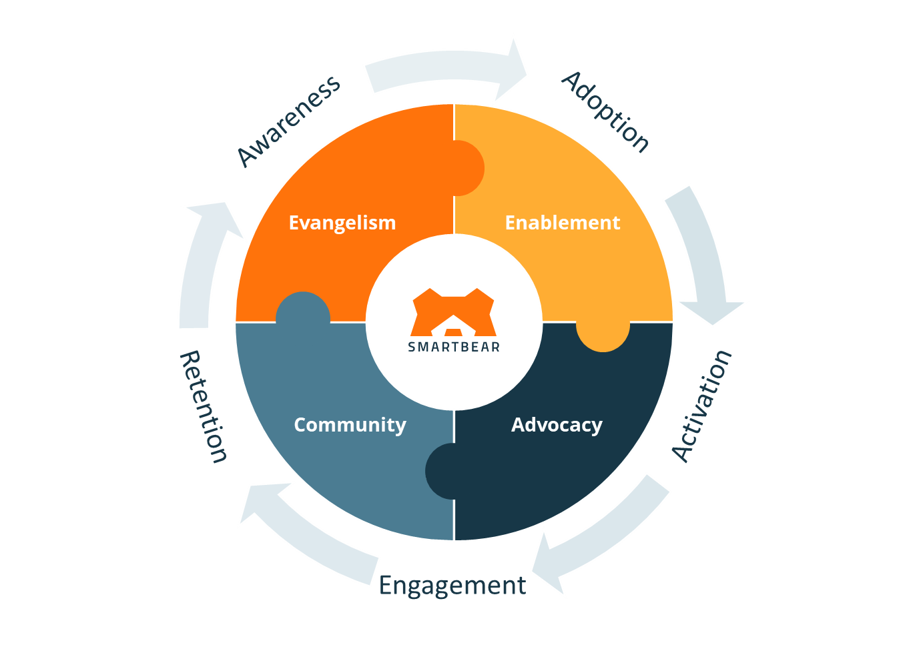

# Welcome to SmartBear Developer Relations :wave:

This location acts as an artifical brain for the SmartBear Developer Relations (DevRel) team. 
We'll add sign posts, sample projects, process information and useful guides aimed at making our communities successful with our open source and commercial offerings 
(and/or combining with other tools and platforms to help you focus on your jobs to be done).

## Mission :dart:
Our mission is to inspire, engage, support and equip a vibrant ecosystem of developers to build the next generation of technology. 
This means empathizing with what they are trying to do, facilitating their success, and advocating for their needs by being the interface between these communities 
and SmartBear’s product, engineering and marketing teams.

## Focus Areas :mag:
DevRel @ SmartBear focuses on the **Evangelism**, **Enablement**, **Advocacy** and **Community** pillars across our open source and commercial offerings. 
We see DevRel act as the face of SmartBear within industry/external communities and thought leadership circles, 
while acting as the representative of those communities internally within SmartBear.

Across the pillar above we:
- Build **awareness** across technical and business communities
- Promote the **adoption** of our capabilities to address industry (and day to day) challenges that impact our communities
- Support the **activation** of the community at large and encourage **engagement** with the end-users and champions who leverage our capabilities to solve real challenges
- Unblock and support our community participants to foster and strengthen relationships and trust, which we hope leads to better **retention** and use of our capabilities.

